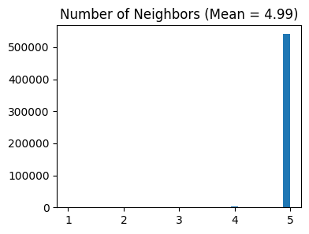
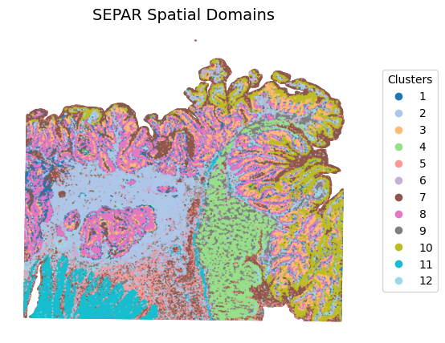
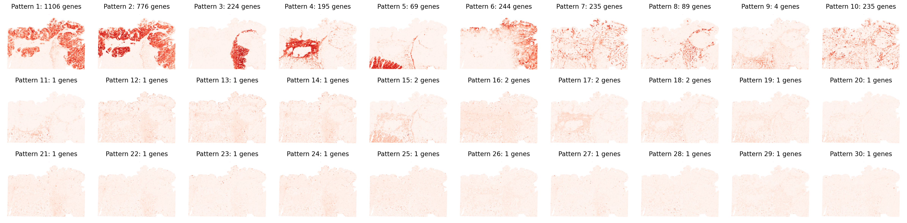

# Tutorial 6: SEPAR Analysis on Human Colorectal Cancer Visium HD Dataset

This tutorial demonstrates SEPAR application to human colorectal cancer Visium HD high-resolution spatial transcriptomics data, showcasing GPU-accelerated computation and spatial pattern recognition in cancer tissue.

## Dataset Information
- **Dataset**: 10X Genomics Human Colorectal Cancer Visium HD (P2CRC sample)
- **Resolution**: 8μm, near single-cell level
- **Scale**: 545,913 spots, requiring GPU acceleration
- **Source**: https://www.10xgenomics.com/products/visium-hd-spatial-gene-expression/dataset-human-crc

```python
import pandas as pd
import numpy as np
import scanpy as sc
import anndata as ad
import os
import matplotlib.pyplot as plt
from matplotlib.colors import LinearSegmentedColormap
from sklearn.metrics import adjusted_rand_score
from sklearn.metrics.cluster import normalized_mutual_info_score as nmi
from numpy.linalg import norm
import time
import gc
# import pickle
from datetime import datetime

from SEPAR_model import SEPAR

```

    GPU acceleration available with CuPy

## Data Loading and SEPAR Initialization

```python
# Setup analysis paths
savefile = '/home/lzhang/SEPAR/new_out/crc_out/visiumHD/'
result_file = '/home/lzhang/SEPAR/new_out/crc_out/visiumHD/'
filepath = '/scratch/lzhang/dataset_human_crc/visium_hd_adapted_008um.h5ad'
output_dir = '/scratch/lzhang/SEPARout/crcVisiumHD/'

# Load Visium HD dataset
adata = sc.read_h5ad(filepath)
adata.var_names_make_unique()
adata.obsm['spatial'] = adata.obsm['spatial'].astype(float)
loc = adata.obsm['spatial']

print(f"Dataset shape: {adata.shape}")
print(f"Spatial coordinates shape: {loc.shape}")
print(f"Resolution: 8μm per spot")

# Initialize SEPAR with GPU acceleration
separ = SEPAR(adata, n_cluster=16, use_gpu=True, dtype=np.float32)
```

    Dataset shape: (545913, 18085)
    Spatial coordinates shape: (545913, 2)
    Resolution: 8μm per spot
    Using GPU acceleration with device: <CUDA Device 0>

## Data Preprocessing and Quality Control

```python
# Preprocess with stringent filtering
separ.preprocess(min_cells=50)
print(f"After filtering: {separ.adata.shape}")

# Compute spatial adjacency matrix
separ.compute_graph(adjacency_method='kdtree')

# Select spatially variable genes using Moran's I
separ.select_morani(nslt=3000, morans_method='vectorized')
print("Spatial gene selection completed")
```

    After filtering: (545913, 16946)
    WARNING: adata.X seems to be already log-transformed.
    After filtering: (545913, 16946)
    Auto-calculated radius: 39.99
    Computing spatial adjacency using KDTree...
    KDTree computation completed in 0.43 seconds


    

    


    Computing Moran's I for gene selection...
    Computing Moran's I for 16946 genes using vectorized approach...
    Selected top 3000 genes with highest Moran's I scores
    Top 5 Moran's I scores: [0.83368266 0.75054314 0.73968617 0.68365797 0.67907498]
    Gene selection based on Moran's I completed
    Spatial gene selection completed


For large-scale Visium HD datasets (>100K spots), SEPAR provides optimized computational methods:

- **`adjacency_method='kdtree'`**: KDTree-based neighbor search for efficient spatial graph construction
- **`morans_method='vectorized'`**: Vectorized Moran's I computation for faster spatial gene selection 

```python
# Compute weighted adjacency with cosine similarity
separ.compute_weight(metric='cosine', weight_method='optimized')
print("Weighted adjacency computation completed")

# Optional: Save checkpoint before intensive computation
# save_checkpoint(separ, "weighted_adj")
```

    Estimating sigma parameter...
    Estimated sigma: 0.6617 (Time: 0.37s)
    Computing weights for 2177356 adjacency pairs...


    Computing weights: 100%|███████████████████████████████████████████████| 2177356/2177356 [00:39<00:00, 54983.39it/s]


    Weighted adjacency computation completed

**`weight_method='optimized'`**: Sparse matrix operations with sampling-based parameter estimation


## Running SEPAR Algorithm on High-Resolution Data

Execute the core SEPAR algorithm with parameters optimized for Visium HD data:

```python
separ.separ_algorithm(
    r=30,           
    alpha=0.3,      
)

# Save checkpoint after algorithm completion
# save_checkpoint(separ, "r30alpha03")

# Alternative: Load from existing checkpoint
# separ = load_checkpoint('/scratch/lzhang/SEPARout/crcVisiumHD/checkpoints/r30alpha03_0716_2230.pkl')
```

    Starting SEPAR algorithm...
    Using parameters: alpha=0.3, beta=0.02, gamma=0.3
    Initializing factor matrices...


    SEPAR iterations: 100%|███████████████████████████████████████████████████████████| 100/100 [03:42<00:00,  2.22s/it]


    SEPAR algorithm completed in 617.46 seconds

```python
separ.clustering(
    n_cluster=12,
    N1=10,
    N2=9
)

separ.labelres = separ.labelres + 1

clusters = separ.adata.obs['clustering'].astype(int)
fig, ax = plt.subplots(figsize=(7, 5), dpi=100)  
scatter = ax.scatter(separ.loc[:, 0], -separ.loc[:, 1],   
                    c=separ.labelres, s=0.1, cmap='tab20')  
plt.title("SEPAR Spatial Domains", fontsize=14)  
plt.axis('off')  

# Add legend  
legend = ax.legend(*scatter.legend_elements(),  
                  title="Clusters",  
                  bbox_to_anchor=(1.05, 0.5),  
                  loc='center left')  

plt.subplots_adjust(right=0.75)  
plt.show()  
```


    

    


```python
pattern_specific_features = separ.identify_pattern_specific_genes(  
    n_patterns=30,   
    threshold=0.3  
)  
# Visualize all spatial patterns
sim_slt = separ.sim_res(separ.Wpn, separ.Hpn, separ.Xt.T)
sim_argsort = np.argsort(-sim_slt)

num_patterns = 30
plt.figure(dpi=200, figsize=(24, 6))
for i in range(30):
    ii = sim_argsort[i]
    plt.subplot(3, np.int(num_patterns/3), i + 1)
    plt.scatter(separ.loc[:, 0], -separ.loc[:, 1], 
                c=separ.Wpn[:, ii].reshape(-1, 1), 
                s=0.1, cmap='Reds')
    plt.axis('off')
    plt.title(f'Pattern {i + 1}: {np.int(separ.genes_per_pattern[ii])} genes', 
              fontsize=12)
plt.tight_layout()
plt.show()
```


    

    


```python

```
